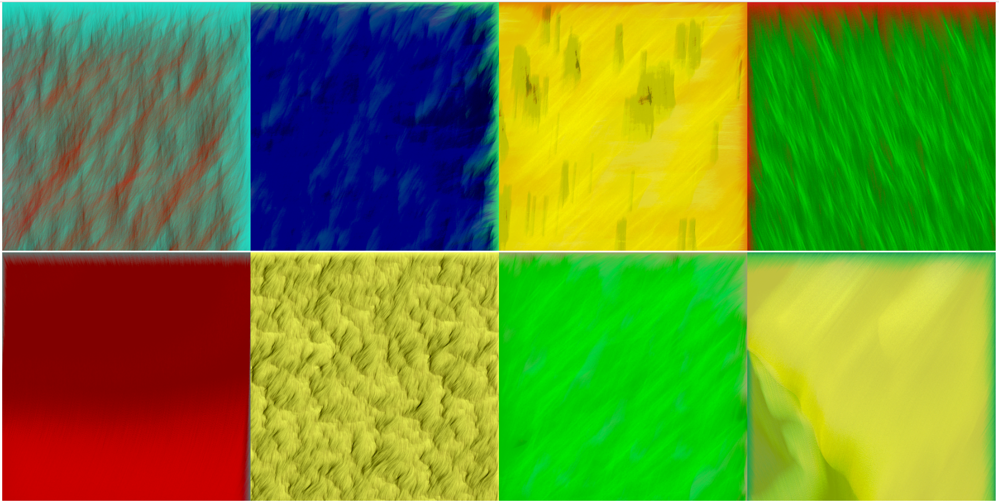

# GenerativeArtNFT

[](https://github.com/Japan-DfinityInfoHub/generative-art-nft/actions/workflows/test.yml)



This is an NFT project for [NFTBarter](https://github.com/Japan-DfinityInfoHub/nft-barter) demonstration.

## Running the project locally

If you want to run this project locally, you can use the following commands:

```bash
git clone https://github.com/Japan-DfinityInfoHub/generative-art-nft.git
cd ./generative-art-nft

# Starts the replica, running in the background
dfx start --background --clean

# Deploys your canisters to the replica
./scripts/install_local.sh 
```

To generate generative art images and upload them to the canister:
```bash
# Install required packages
npm i

# Generate generative art images with token index 0~3
npm run generate:images -start=0 -end=3

# Upload the images to the canister
./scripts/update_token_image_setter.sh
npm run upload:images -start=0 -end=3
```
You can get outputs as below; click the link to see the art images.
```bash
Uploading image No. 1 that is available at http://rrkah-fqaaa-aaaaa-aaaaq-cai.localhost:8000?tokenid=nelid-eakor-uwiaa-aaaaa-aaaaa-eaqca-aaaaa-q ...
Uploading image No. 2 that is available at http://rrkah-fqaaa-aaaaa-aaaaq-cai.localhost:8000?tokenid=6ap5a-kqkor-uwiaa-aaaaa-aaaaa-eaqca-aaaab-a ...
Uploading image No. 3 that is available at http://rrkah-fqaaa-aaaaa-aaaaq-cai.localhost:8000?tokenid=q4mob-pakor-uwiaa-aaaaa-aaaaa-eaqca-aaaab-q ...
```

## Running tests
To run tests:
```bash
# Run canister e2e tests
npm run test

# Run Motoko unit tests
./scripts/motoko_tests.sh
```
